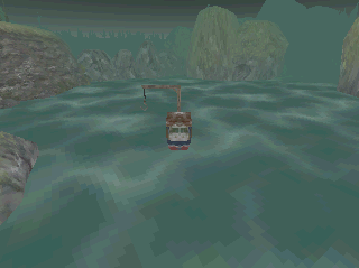
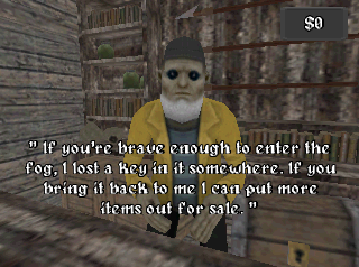
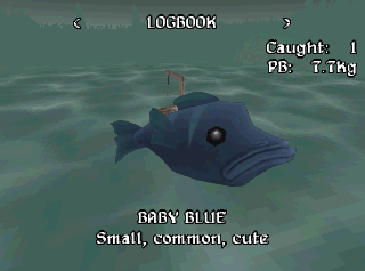

## The Deep Ones

Fully playable at https://bronxtaco.itch.io/the-deep-ones. So check it out! 

This was an entry for 32-Bit Game Jam. With the aim to create a PS1 era style game. 
It also had an optional theme of Another World or The Ocean (we kinda did both themes)

### The Team
Luka Pavlovich - Art (Main world / Shopkeeper / Fish), Game Design
[ArtStation](https://www.artstation.com/lukapavlovich) | [Level Design Portfolio](https://lukapavlovich.squarespace.com/)

Tim Day - Programming (UI / Game Flow), Game Design
[Gamedev Discord](https://discord.com/invite/NB542RwpJR) | [itch.io](https://bronxtaco.itch.io/)

Jake Archer - Music and Sound Design
[@jakeonkeys](https://www.instagram.com/jakeonkeys/?hl=en)

Nicholas Kerr - Art (Shop / Boat)
[ArtStation](https://www.artstation.com/nicholaskerr) | [itch.io](https://itch.io/profile/nickowiss)

And me(Dom Lawlor) - Programming (Gameplay), Game Design
[Github](https://github.com/domlawlor) | [itch.io](https://itch.io/profile/dom-lawlor)
